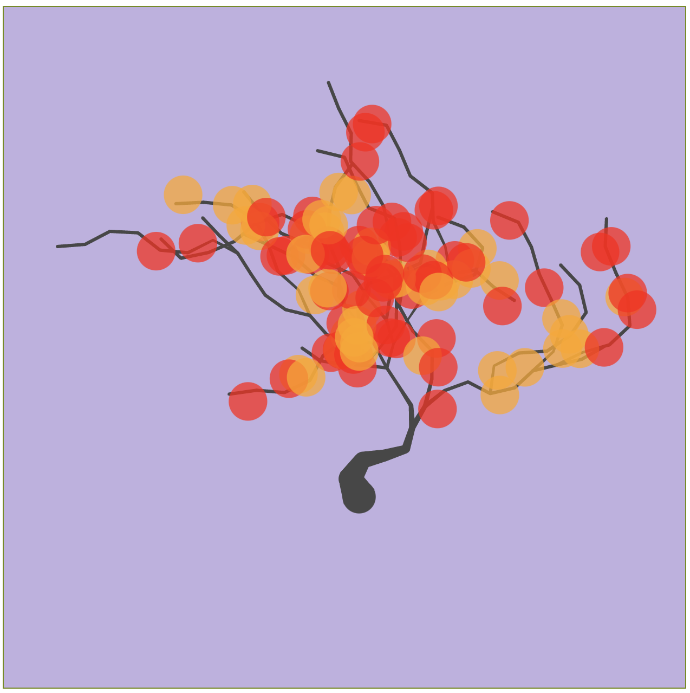
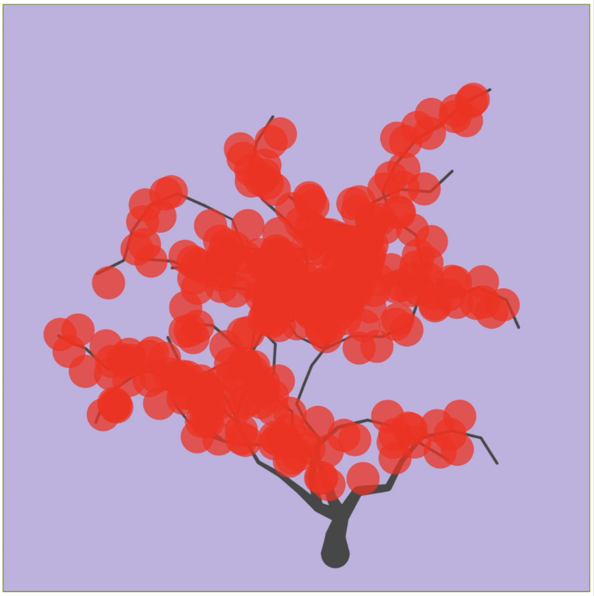
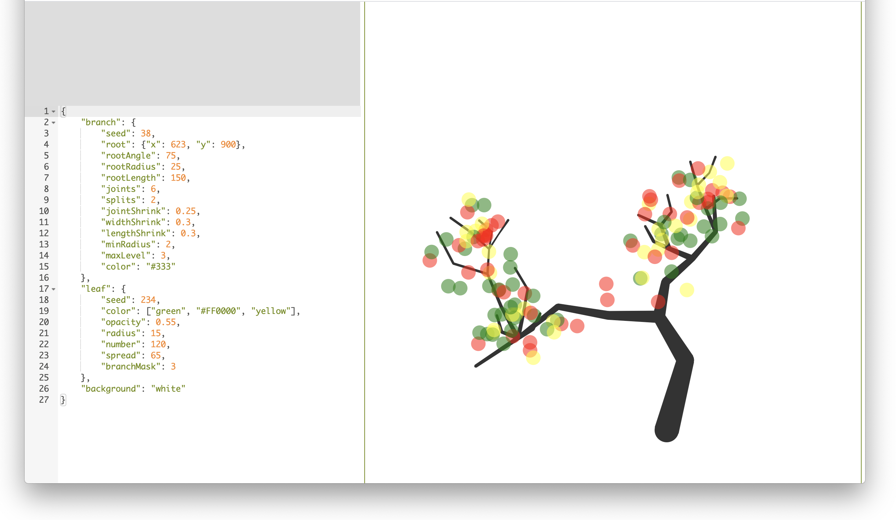

# SVTree

Create SVG Trees in real-time by editing JSON objects with the Ace browser based text-editor enhanced with scrubber controls for integers and float values.

# Screenshots







# TODO

- [x] Create split screen with ACE on left side
- [x] Can I use an Ace token to get position info in order to display a scrubber
    - [x] Idea: Ace token is the `value`
    - [x] Idea: rows are fixed height and can be counted
    - [x] Idea: Columns are mono-space fixed and can be counted
    - [x] Idea: Width and height of Token is known (number of characters)
- [x] Add check in `changeSelection` to verify that cursor is over a scrubber value
- [x] Use Scrubber class to place the scrubber
- [x] Detect updates    
- [x] Relay update info to currently targeted token
- [x] Reposition `range` for `editor.session.replace` to cleanly cover value
- [x] IDEA: use remove and insert instead and these depend less on exact length of input
- [x] Use `mousedown`, `mousemove`, and `mouseup` to track value adjustment
- [x] Place SVG on the right side
- [x] Create SVG test code
    - [x] Simple JSON object `one property`
    - [x] Use simple JSON to create circles in a grid
    - [x] See how D3 handles that
- [x] Design the JSON tree API
- [x] Continue work on makeTree and makeBranches
- [x] Use `makeTree` and `getBranches`, which now work, to render a tree without leaves
    - [x] Make sure API config values are causing the correct number of levels and branches
- [x] Port branch code from old code base
- [x] Implement `getLeaves` to place leaves on the tree
- [x] Bug: scrubber handle does not show for some numbers
- [x] Use new regex matchAll to find values
- [x] Connect new regex matchAll results with scrubber list

- [ ] Scrubber style for `int` and `float`
- [ ] Implement `color` scrubber

- [ ] Scrubber style `random`
- [ ] Scrubber style `color`

- [ ] Bug: Branches sometimes render in-front of leaves due to D3 cashing/updating I assume
- [ ] Bug: Scrubber handle is behind SVG drawing
- [x] Fix: Floating points are updated like ints
- [ ] Style the regular scrubber handle
- [ ] Create random scrubber button
- [ ] Clean up tree rendering code
    - [ ] Have code pull from `seed random`
    - [ ] Code should output a D3 parsable data set of branches and leaves
- [ ] Editing JSON triggers a re-render which replaces `data` object
    - [ ] Data should automatically be handled by D3
- [ ] Allow multiple trees by passing an array of JSON objects in Ace

# Architecture

Global state object, called `state`, is controlled by `Redux`. The view bound to the `state` by VueJS and D3. ViewJS handles menus and non-SVG state. D3 ensures the current data is reflected by the SVG document.

# Overview

The user edits a `JSON object` using scrubber controls in the ACE text editor. The real-time state of the JSON object is used to create `data`. The `data` is fed through D3 to sync the SVG document. Menus and state (other than the SVG document) are synced using VueJS.

# API
```
{
    "branch": {
        // Random seed to control branch layout
        "seed": 38,
        // Start point for base branch segment
        "root": {"x": 623, "y": 900},
        // Angle tree makes with ground (90 is straight up)
        "rootAngle": 75,
        // Start radius for base branch segment
        "rootRadius": 25,
        // Length of base branch segment
        "rootLength": 150,
        // Number of 'bends' in a branch
        "joints": 6,
        // Number of branches that split off from a parent branch
        "splits": 2,
        // Percent reduction in joints for child branches
        "jointShrink": 0.25,
        // Percent reduction in width for child branches
        "widthShrink": 0.3,
        // Percent reduction in length for child branches
        "lengthShrink": 0.3,
        // Minimum allowable branch thickness        
        "minRadius": 2,
        // Max number of levels of child branches
        "maxLevel": 3,
        // Branch color
        // Format: "green", "#333", or "rgba(45,45,45,0.4)"
        "color": "#333"
    },
    "leaf": {
        // Random seed to control leaf layout
        "seed": 234,
        // Color of leaves (even distribution)
        // Format: "green", "#333", or "rgba(45,45,45,0.4)"
        "color": ["green", "#FF0000", "yellow"],
        // Leaf opacity
        "opacity": 0.55,
        // Leaf radius
        "radius": 15,
        // Number of leaves
        "number": 120,
        // Distance from leaf to branch is random between 0 and set number
        "spread": 65,
        // Number of branch segments to ignore starting from base branch
        // segment when randomly placing leaves
        "branchMask": 3
    },
    // Background color behind tree
    // Format: "green", "#333", or "rgba(45,45,45,0.4)"
    "background": "white"
}
```
